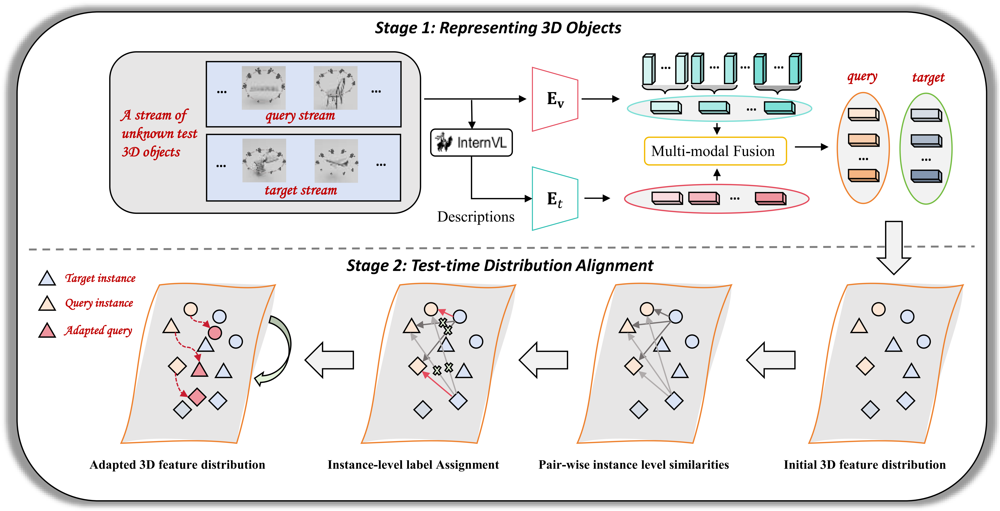

# TeDA: Boosting Vision-Lanuage Models for Zero-Shot 3D Object Retrieval via Testing-time Distribution Alignment

Zhichuan Wang<sup>1</sup>, <a href="https://scholar.google.com/citations?user=9oXvA2IAAAAJ&hl=zh-CN&oi=sra">Yang Zhou</a><sup>2</sup>, <a href="https://scholar.google.com/citations?hl=zh-CN&user=z4YTksIAAAAJ">Jinhai Xiang</a><sup>1</sup>, <a href="https://scholar.google.com/citations?view_op=list_works&hl=zh-CN&hl=zh-CN&user=CplmfKMAAAAJ&sortby=pubdate">Yulong Wang*</a><sup>1</sup>, <a href="https://scholar.google.com/citations?user=YSIe_24AAAAJ&hl=zh-CN&oi=sra">Xinwei He*</a><sup>1</sup>

<sup>1</sup>Huazhong Agricultural University  <sup>2</sup>Shenzhen University


**🚀🚀🚀TeDA has been accepted to the ICMR2025-Full Papers track at the ICMR 2025 conference🚀🚀🚀**


Abstract: *Learning discriminative 3D representations that generalize well to unknown testing categories is an emerging requirement for many real-world 3D applications.
Existing well-established methods often struggle to attain this goal due to insufficient 3D training data from broader concepts. 
Meanwhile, pre-trained large vision-language models (e.g., CLIP) have shown remarkable zero-shot generalization capabilities. Yet, they are limited in extracting suitable 3D representations due to substantial gaps between their 2D training and 3D testing distributions.
To address these challenges, we propose Testing-time Distribution Alignment (TeDA), a novel framework that adapts a pretrained 2D vision-language model CLIP for unknown 3D object retrieval at test time. To our knowledge, it is the first work that studies the test-time adaptation of a vision-language model for 3D feature learning.
TeDA projects 3D objects into multi-view images, extracts features using CLIP, and refines 3D query embeddings with an iterative optimization strategy by confident query-target sample pairs in a self-boosting manner. 
Additionally, TeDA integrates textual descriptions generated by a multimodal language model (InternVL) to enhance 3D object understanding, leveraging CLIP's aligned feature space to fuse visual and textual cues. Extensive experiments on four open-set 3D object retrieval benchmarks demonstrate that TeDA greatly outperforms state-of-the-art methods, even those requiring extensive training. We also experimented with depth maps on Objaverse-LVIS, further validating its effectiveness.*
<!-- This repository contains the source code for the paper "TeDA: Boosting Vision-Lanuage Models for Zero-Shot 3D Object Retrieval via Testing-time Distribution Alignment". -->



## Data Preparation

To download the four datasets (OS-ESB-core, OS-NTU-core, OS-MN40-core, and OS-ABO-core) for the Open-Set Retrieval task, please refer to [HGM2R](https://github.com/iMoonLab/HGM2R/tree/main). To download the Objaverse dataset, please refer to [OpenShape](https://github.com/Colin97/OpenShape_code).


## Requirement

Core packages:
- Pytorch version 2.4.0

- clip version 1.0

- open-clip-torch version 2.24.0

- transformers version: 4.37.2

- numpy version 1.26.4

- open3d version 0.18.0

## Usage

Run bash scripts/run.sh [dataset] [backbone] [open_clip] [gpu_id] to run TeDA, e.g.

```
bash scripts/run.sh esb ViT-L/14 true 0
```

If you have already extracted and saved the features, you can use the following command to directly test TeDA :

```
python run_teda.py --dataset esb --backbone ViT-L/14 --open_clip true
```

<!-- First, you need to use InternVL to extract text description information with the following command:

```bash
python internVL_feats_extract.py --dataset esb
```

Second, use CLIP to extract image features with the following command:

```bash
python image_feats_extract.py --dataset esb
```

Then, test the performance of TeDA. with the following command:

```bash
python run_teda.py --dataset esb
``` -->


## Citation
Thanks for citing our paper:

```
@article{wang2025teda,
  title={TeDA: Boosting Vision-Lanuage Models for Zero-Shot 3D Object Retrieval via Testing-time Distribution Alignment},
  author={Wang, Zhichuan and Zhou, Yang and Xiang, Jinhai and Wang, Yulong and He, Xinwei},
  journal={arXiv preprint arXiv:2505.02325},
  year={2025}
}
```

## Acknowledgement

TeDA is built using the awesome [HGM2R](https://github.com/iMoonLab/HGM2R/tree/main), [InMaP](https://github.com/idstcv/InMaP) ,[CLIP](https://github.com/openai/CLIP), [OpenCLIP](https://github.com/mlfoundations/open_clip), [InternVL](https://internvl.readthedocs.io/en/latest/) ,and [OpenShape](https://github.com/Colin97/OpenShape_code).
